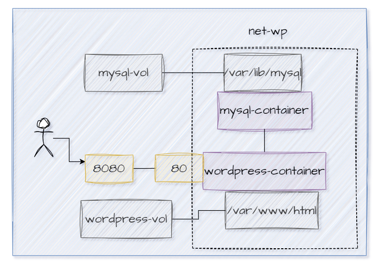

# Docker Compose
Es una herramienta que permite definir y gestionar aplicaciones Docker multi-contenedor de forma sencilla. Puedes usar un archivo YAML usuamente llamado compose.yaml para configurar los servicios de tu aplicación, como contenedores, redes y volúmenes, y luego iniciar toda la aplicación con un solo comando.

Docker Compose simplifica el proceso de definir la estructura de una aplicación con múltiples servicios y sus interacciones, lo que facilita el desarrollo, la prueba y el despliegue de aplicaciones complejas.

Un archivo YAML (YAML Ain't Markup Language) se forma utilizando una estructura de datos basada en texto. Para el archivo considerar:
## Indentación
YAML usa espacios para la indentación, no tabuladores.
La indentación indica jerarquía. Asegúrate de usar el mismo número de espacios para cada nivel de indentación.
## Claves y valores
Las claves y valores se separan por dos puntos seguidos de un espacio (:).

## Ejercicio
El archivo compose.yaml permitirá configurar dos servicios de acuerdo con el siguiente esquema:



### Revise el archivo archivo compose.yaml y complete solamente las partes que solicitan <valor>, para eso considerar:
- La clave **services** define los servicios (contenedores) que conforman tu aplicación. Cada servicio se describe con un nombre único y contiene configuraciones específicas como la imagen de Docker que debe usar, los volúmenes, las redes, las variables de entorno, y más. Para el ejercicio es necesario definir dos servicios: mysql-service y wordpress-service.
- Es necesario configurar las variables de entorno para cada uno de los contenedores
- Realizar el mapeo de puertos para Wordpress host:contenedor
- Healthcheck de cada uno de los servicios.
    - Línea 17 test: ["CMD", "mysqladmin", "ping", "-h", "localhost"] para verificar si el servidor MySQL está en funcionamiento y puede responder a las solicitudes de ping.
    - Línea 38 test: ["CMD", "curl", "-f", "http://localhost"] para verificar si un servidor HTTP en el contenedor está funcionando y respondiendo correctamente.
- La dependencia entre el servicio de wordpress y la base de datos, se indica en las líneas 44-46
  - depends_on: Establece dependencias entre servicios. El servicio actual **wordpress-service** depende del servicio **mysql-service**. Podemos usar los nombres directamente ya que ambos contenedores pertenecen a la red de tipo bridge.
  - condition: service_healthy significa que el servicio actual solo se iniciará después de que el servicio mysql-service esté en un estado saludable, es decir, después de que pase su healthcheck.
- Línea 43 es necesario que el wordpress-container se encuentre disponible en todo momento, defina una política de reinicio adecuada para esto
- wordpress-vol y mysql-vol son volúmenes nombrados.

### Ejecutar Docker compose
Este comando descargará las imágenes necesarias, creará y ejecutará los contenedores según lo definido en el archivo compose.yaml
Para ejecutar en modo "detached" (en segundo plano) se agrega la opción -d:
```
docker compose up -d
```

### Ejecutar Docker compose para servicios que no se crearon correctamente
Si algún servicio no se creó correctamente se puede usar
```
docker compose up -d <nombre servicio>
```

### Listar contenedores en ejecución que se crearon por docker compose
```
docker compose ps
```
### COMPLETAR CON UNA CAPTURA DE PANTALLA DEL LISTADO DE LOS CONTENEDORES EN EJECUCIÓN

### Detener y eliminar los contenedores definidos en el archivo
```
docker compose down
```
